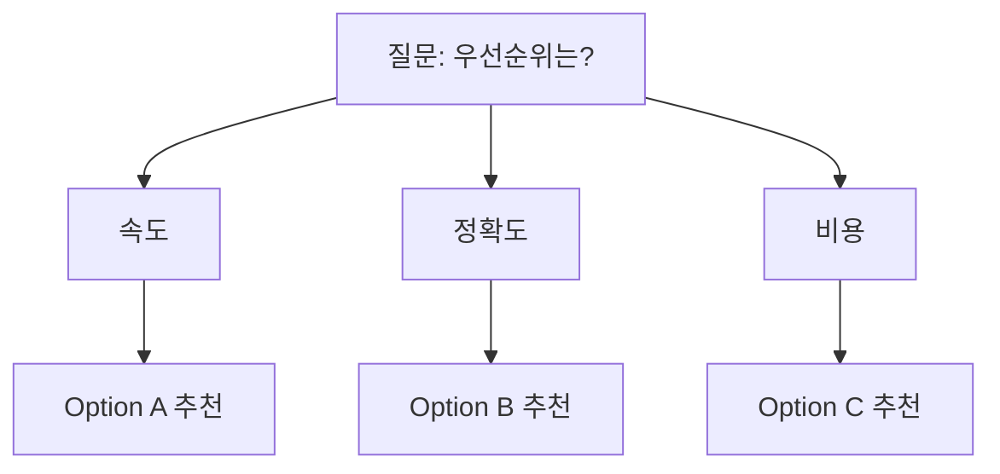

# wiki compare — 5차원 비교 매트릭스 + Decision Guide

> **목적**: 2-5개 볼트 파일/주제를 비교하여 **의사결정 도구** 산출. 단순 정보 나열이 아닌 "그래서 어느 걸 골라야?" 답을 줘야 함.
>
> **wiki ↔ feynman 경계**:
> - feynman source-comparison = 외부 학술 source 비교
> - **wiki compare = 볼트 파일/주제 비교** (이 파일)
> - 별개 커스텀 구현, 호출 의존 없음.

---

## 0. Wikilink Safety

`[[링크]]` 작성 전 대상 페이지 존재 확인 (refs/save.md §0). 없으면 plain text.

---

## 1. 입력 유형 (3가지)

### 1a. 명시 파일 (2-5개)
```
wiki compare 10_Raw/01_Articles/A.md 10_Raw/06_Research/B.md 20_Wiki/03_Concepts/C.md
```
- 2개 미만 → "최소 2개 필요". 5개 초과 → "5개 이상은 인지 부담. synthesize 사용 권장".
- 직접 Read 후 비교

### 1b. 주제 (자동 수집)
```
wiki compare "RAG vs LLM Wiki vs GraphRAG"
```
- qmd search로 각 주제 대표 파일 1-2개씩 자동 anchor (총 3-10개)
- 사용자에 anchor list 보여주고 confirm ("이 파일들로 비교 OK?")

### 1c. Hybrid
```
wiki compare 10_Raw/A.md "GraphRAG"
```
- 명시 파일 + 자동 수집 결합

---

## 2. 5차원 매트릭스 (Q4.1=A 결정 — 5차원 유지)

| # | Source | Key Claim | Evidence Type | Caveats | Confidence |
|---|---|---|---|---|---|
| 1 | [[A 파일명]] | A의 핵심 주장 | primary/secondary/anecdotal | A의 한계 | 0.0~1.0 |
| 2 | [[B 파일명]] | B의 핵심 주장 | ... | ... | ... |

**5차원 정의**:
- **Source**: 파일 경로 또는 외부 URL (인용 가능)
- **Key Claim**: 핵심 주장 한 문장 (paraphrase 금지, 원문 인용 또는 가까운 요약)
- **Evidence Type**:
  - `primary`: 1차 source (논문, 데이터, 직접 관찰)
  - `secondary`: 2차 (잘 cited 블로그, 리뷰)
  - `self-reported`: 자기 주장 (회사 페이지, 마케팅)
  - `anecdotal`: 일화적
- **Caveats**: 한계 / 적용 조건 / 약점
- **Confidence**: 0.0-1.0 (frontmatter `confidence` 또는 추정)

---

## 3. Agreement / Disagreement / Uncertainty 3상태 분류

매트릭스 다음에 **반드시** 3섹션:

```markdown
## Agreement
*(여러 source가 합치하는 것 — 신뢰도 높은 공통 사실)*

- 모든 source 동의: ...
- A, B 동의 (C는 침묵): ...

## Disagreement
*(source 간 명백한 차이 — 의사결정 핵심)*

- **A vs B**: A는 X 주장, B는 Y 주장. 차이 원인: ... (date / 측정방법 / context)
- **B vs C**: ...

## Uncertainty
*(어느 쪽도 충분 evidence 없음 — Open Question)*

- "X와 Y 중 어느 게 나은지"는 어떤 source도 명확히 다루지 않음
```

---

## 4. Decision Guide (Q4.1=A 신규 — 의사결정 도구화)

매트릭스/3상태 다음 마지막 섹션. **"그래서 어느 걸?" 명확히 답**:

```markdown
## Decision Guide

### 이 상황 → 이 옵션
| 상황 | 추천 | 이유 |
|---|---|---|
| {조건/제약 1} | {Option A} | A는 X에 강함 (Source #1 §...) |
| {조건/제약 2} | {Option B} | B는 Y에 강하고 caveat가 적음 (#2) |
| {조건/제약 3} | {Hybrid} | A의 X + B의 Y 결합 가능 |

### 의사결정 트리 (선택)


### Trade-off 요약
- A 선택 시 잃는 것: ... 얻는 것: ...
- B 선택 시 잃는 것: ... 얻는 것: ...
```

---

## 5. Visuals (선택)

### 정량 비교
quantitative metric 있는 경우만 chart. 없으면 표만:
- ASCII bar chart 또는 Mermaid `pie`
- **발명 데이터로 차트 만들지 말 것** (writer.md 흡수)

### Architecture 비교
Mermaid `graph` 또는 `flowchart` (source 지원 시만)

---

## 6. 6단계 워크플로우 (synthesize와 유사하되 단순)

```
Plan → Gather → Compare → Decide → Verify → Deliver
```

| 단계 | 동작 | 산출 |
|---|---|---|
| 1. Plan | 비교 차원 + sources 정리 | 30_Claude/04_Plans/compare-{slug}-plan.md (큰 비교만, optional) |
| 2. Gather | 입력 파일 Read 또는 qmd search anchor | (in-memory) |
| 3. Compare | 5차원 매트릭스 작성 | (draft) |
| 4. Decide | Agreement/Disagreement/Uncertainty + Decision Guide | (draft) |
| 5. Verify | 모든 인용 file:line 검증 (grep) | (sweep) |
| 6. Deliver | 최종 리포트 | 20_Wiki/04_Comparisons/compare-{date}-{slug}.md ✅ |

---

## 7. Output 포맷

저장 위치: `30_Claude/06_Designs/compare-{YYYY-MM-DD}-{slug}.md`

```markdown
---
title: "Compare: {topic} (YYYY-MM-DD)"
type: comparison
date: YYYY-MM-DD
sources:
  - "[[A]]"
  - "[[B]]"
  - "[[C]]"
tags:
  - 개발/비교
  - 프로젝트/위키시스템
status: developing
---

# Compare: {topic}

## TL;DR

> **Quick answer**: {조건}이면 A, {조건}이면 B 추천.

## 비교 매트릭스 (5차원)

| # | Source | Key Claim | Evidence | Caveats | Confidence |
|---|---|---|---|---|---|
| 1 | [[A]] §3 | "A는 X..." | primary | scale 한계 | 0.8 |
| 2 | [[B]] §5 | "B는 Y..." | secondary | 1 source only | 0.6 |
| 3 | [[C]] | "C는 Z..." | anecdotal | n=3 | 0.4 |

## Agreement
- ...

## Disagreement
- A vs B: ...

## Uncertainty
- ...

## Decision Guide

### 상황별 추천
| 상황 | 추천 | 이유 |
|---|---|---|
| ... | A | ... |
| ... | B | ... |

### Trade-off
- ...

## Sources

### 볼트
1. [[A]] §3 — ...
2. [[B]] §5 — ...

### 외부 (사용 시)
3. https://... — Tier 3 fact-check

## Verification: PASS | PASS WITH NOTES | BLOCKED
```

---

## 8. Required Artifacts (NON-NEGOTIABLE)

run 종료 전:

| 산출 | 위치 | 필수 |
|---|---|---|
| Final compare | `20_Wiki/04_Comparisons/compare-{date}-{slug}.md` | ✅ |
| Plan (큰 비교만) | `30_Claude/04_Plans/compare-{slug}-plan.md` | optional |

---

## 9. On-Disk Verification

```bash
VAULT=${VAULT_ROOT}
SLUG=...; DATE=$(date +%Y-%m-%d)

# Final 존재
test -f "$VAULT/20_Wiki/04_Comparisons/compare-$DATE-$SLUG.md" || echo "BLOCKED: missing"

# 모든 wikilink 존재 확인
grep -oP '\[\[\K[^]]+' "$VAULT/20_Wiki/04_Comparisons/compare-$DATE-$SLUG.md" | sort -u | while read link; do
  found=$(find "$VAULT" -iname "${link}.md" -print -quit)
  test -n "$found" && echo "OK: [[$link]]" || echo "BROKEN: [[$link]]"
done
```

3상태: PASS | PASS WITH NOTES | BLOCKED.

---

## 10. Operating Rules

1. **No paraphrase in Key Claim** — 원문 인용 또는 가까운 요약 (왜곡 금지)
2. **Decision Guide 필수** — 단순 매트릭스만은 compare 아닌 query (의사결정 답 없으면 가치 X)
3. **Confidence 추정 시 명시** — 추정이면 "(estimated)" 라벨
4. **5차원 유지** (Q4.1=A) — 더 추가하면 인지 부담, 줄이면 부족
5. **Trade-off 명시** — "A가 모든 면에서 우세" 같은 거짓 결론 X
6. **No invented data** — chart는 source-backed only

---

## 11. Examples

### 예 1 — 명시 파일 비교
```
User: "wiki compare 10_Raw/06_Research/A.md 10_Raw/06_Research/B.md"
Claude:
  [Read A, B]
  [5차원 매트릭스 작성]
  [Agreement: 2건 / Disagreement: A vs B 핵심 1건 / Uncertainty: 1건]
  [Decision Guide: "정확도 우선 → A, 속도 우선 → B"]
  [Save 20_Wiki/04_Comparisons/compare-2026-04-20-{slug}.md]
  [On-Disk verify]
```

### 예 2 — 주제 (자동 수집)
```
User: "RAG vs LLM Wiki vs GraphRAG 비교"
Claude:
  [qmd search 각 키워드 → 6 파일 anchor 후보]
  [사용자 confirm: "이 6개로 비교 OK?"]
  [Read 6개 + 5차원 매트릭스 (3 옵션 × 2 source씩)]
  [Decision Guide: "외부 논문 합성 → feynman, 볼트 내부 → wiki, 그래프 강조 → GraphRAG"]
  [Save]
```

---

## Output

- **출력 위치**: `30_Claude/06_Designs/compare-{YYYY-MM-DD}-{slug}.md` (MANDATORY)
- **부수**: Plan (큰 비교, optional)
- **저장 후**: index.md / log.md 갱신 + `qmd update && qmd embed` + On-Disk verify

호출: `/wiki compare <files...>` 또는 `/wiki compare "<topic>"` 또는 자연어 ("A vs B", "비교해줘", "어느 게 나아?").
